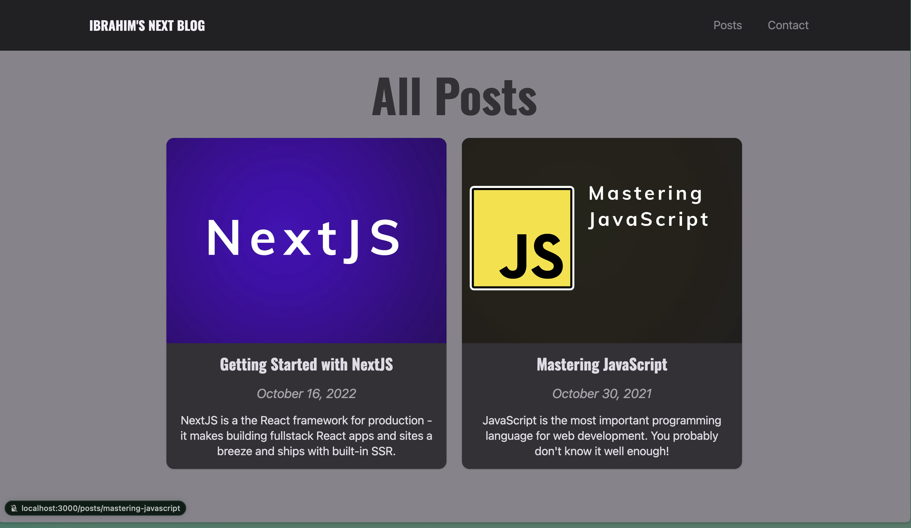

# My Blog

This is a small [Next.js](https://nextjs.org/) project bootstrapped with [`create-next-app`](https://github.com/vercel/next.js/tree/canary/packages/create-next-app).

## Project Description

It is a small blog project that allows the user to create and publish blog posts. The project aims to provide a simple and user-friendly interface for blogging, and display basic knowledge of React, Typescript and NextJS.

## Main Features

- Blog post creation: Allows users to write a blog article using markdown.
- Blog Post display: Allows the users to consult the list of featured posts, all the posts or a single post.
- Send messages using a contact form.

